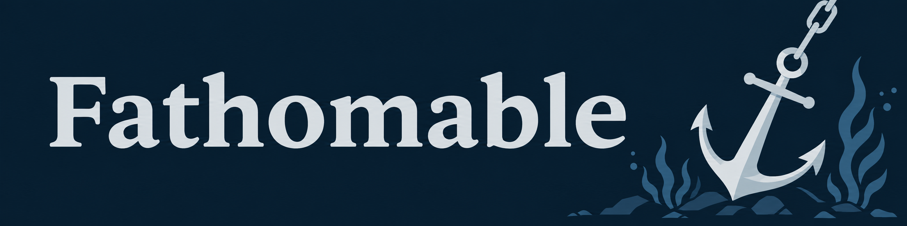

A read-only workspace viewer for reviewing diffs and interactive comment
threads with agents via MCP.

## Install

Fathomable currently requires Rust 1.95+ and a Linux host.

```sh
# Azure Linux 4 / Fedora
sudo dnf install gcc git curl ca-certificates tar

# Azure Linux 3
sudo tdnf install build-essential git curl ca-certificates tar

# Ubuntu 24.04
sudo apt-get update
sudo apt-get install build-essential git curl ca-certificates tar

# Install Rust
curl --proto '=https' --tlsv1.2 -sSf https://sh.rustup.rs | sh
. "$HOME/.cargo/env"

# Installing from crates.io
cargo +stable install fathomable --locked

# Installing from the repo
git clone https://github.com/hbeberman/fathomable
cd fathomable
cargo +stable install --path crates/fathomable --locked

# Ensure ~/.cargo/bin is in PATH
fathomable --version
```

## MCP setup

**Copilot CLI:** register once, then launch Copilot from the checkout you
want to review:

```sh
copilot mcp add fathomable -- fathomable --mcp
```

**VS Code:** register for your user profile, using the open workspace:

```sh
code --add-mcp '{"name":"fathomable","type":"stdio","command":"fathomable","args":["--mcp","${workspaceFolder}"]}'
```

Fathomable must be on `PATH` in the Linux environment where the server runs.
See the [setup guide](docs/guide.md#connect-an-agent) for configuration and
remote-workspace details.

## Using it

```sh
fathomable               # Open the cwd or parent git repo
fathomable README.md     # Open on a single file
```

The [setup guide](docs/guide.md) covers the UX, KDL configuration, saved
state, and connecting an agent over MCP.

## Contribute

See [CONTRIBUTING.md](.github/CONTRIBUTING.md) for build environment setup,
including the commit gate, dependency monitoring, and maintaining the doc
bundle. Durable project knowledge lives under [`docs/`](docs/index.md).

## AI Notice
This project is developed largely via LLM coding agents.

## Support Policy
**Early alpha:** expect features to appear, change, or disappear at
any time. Fathomable stores are not guaranteed to survive upgrades or
downgrades; treat annotations, review points, and other app state as
disposable between versions. Keep important review conclusions elsewhere.
Incompatible stores are refused, not automatically migrated or deleted. A
backup may require the exact build that wrote it.

## License

[MIT](LICENSE).

Third-party components retain their own licenses. The checked-in
[license bundle](crates/fathomable/assets/licenses.txt) contains their license
texts, copyright notices, and source references. It is also available offline
in the viewer through **Help > Licenses**.
